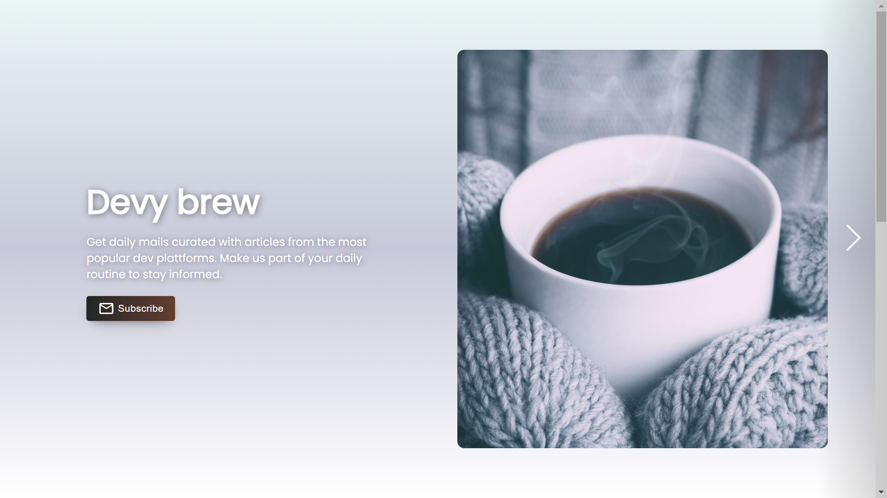

# Devy Brew ☕

Get curated emails containing featured articles and products from hashnode, dev.to, product hunt and more...

# Made 🛠

This was built with:

* React, CSS, MUI, svg-loader-react
* Firebase, Axios, HarperDb, MailChimp

# Features ⚡

* Articles from:
  * hashnode
  * dev.to
  * producuts from **ProductHunt**

# Future Features 🚀

1. Comic Strip
2. Jokes Section
3. WordSearch / Crossword puzzles
4. Puzzles
5. RSS Feed

## Contributing 🙋‍♂️

Pull requests are welcome. For major changes, please open an issue first to discuss what you would like to change.

1. Fork it ([https://github.com/arndom/dev-brew/fork](https://github.com/arndom/dev-brew/fork))
2. Create your feature branch (`git checkout -b feature/fooBar`)
3. Commit your changes (`git commit -am 'Add some fooBar'`)
4. Push to the branch (`git push origin feature/fooBar`)
5. Create a new Pull Request

Don't forget to leave a ⭐ if you found this useful.
